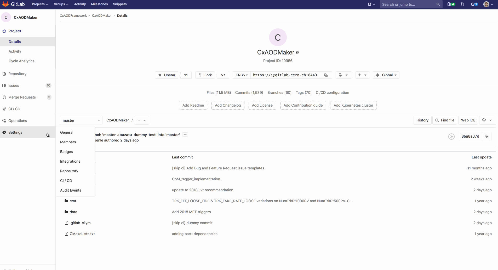

# Using gitlab webhooks to log MRs to TWiki

Gitlab offers the possibility to setup [webhooks](https://docs.gitlab.com/ee/user/project/integrations/webhooks.html).
We use them to automatically update the [list of merge requests](https://twiki.cern.ch/twiki/bin/viewauth/AtlasProtected/Release21Migration#List_of_Merge_requests) on the TWiki.

To do so an API was created. It is hosted on [cern.ch/cxaodframework](https://cern.ch/cxaodframework).

In order to add a package a web hook must be created.
This is done in 5 steps

1. Navigate to the project's Settings->Integrations site
2. Add the API URL: https://cxaodframework.web.cern.ch/api/v1/merge_request_event
3. Add the [secret token](https://gitlab.cern.ch/CxAODFramework/cxaodframework-webservices/blob/175dfc13a30526bced209206448845fbc42371cf/app/routes.py#L33)
4. In the "Trigger" list select only _Merge request events_
5. Click Add webhook




NB: Please do not share the secret token outside of internal projects.

Webhooks for these packages are setup:

* [CxAODBootstrap_VHbb](https://gitlab.cern.ch/CxAODFramework/CxAODBootstrap_VHbb)
* [CxAODOperations](https://gitlab.cern.ch/CxAODFramework/CxAODOperations)
* [CxAODOperations\_VHbb](https://gitlab.cern.ch/CxAODFramework/CxAODOperations_VHbb)
* [CxAODMaker](https://gitlab.cern.ch/CxAODFramework/CxAODMaker)
* [CxAODMaker\_VHbb](https://gitlab.cern.ch/CxAODFramework/CxAODMaker_VHbb)
* [CxAODReader](https://gitlab.cern.ch/CxAODFramework/CxAODReader)
* [CxAODReader\_VHbb](https://gitlab.cern.ch/CxAODFramework/CxAODReader_VHbb)
* [CxAODTools](https://gitlab.cern.ch/CxAODFramework/CxAODTools)
* [CxAODTools\_VHbb](https://gitlab.cern.ch/CxAODFramework/CxAODTools_VHbb)
* [CorrsAndSysts/](https://gitlab.cern.ch/CxAODFramework/CorrsAndSysts/)
* [KinematicFit](https://gitlab.cern.ch/CxAODFramework/KinematicFit)


## More detailed explanation of what's happening

After setting up the web hook a POST request will be send to the API URL after every merge request event.
The request headers contain the information that this is a merge request event and the secret token.
The request body contains a lot of information about the MR in JSON format.
A typical merge request event can be found [here](https://gitlab.cern.ch/CxAODFramework/CxAODReader_VHbb/hooks/970/hook_logs/762773).

The script running the API will listen to a state change and if the condition `prev_state != 'merged' and curr_state == 'merged'` is met a new log entry will be created.

All log entries are gathered in a file that is located on the `vhbbframework` bot's EOS space.

The file is served by the CxAODFramework web resources under this URL: https://cxaodframework.web.cern.ch/merge_requests

This enables us to include them to the TWiki like so

```
---++ List of Merge requests
%INCLUDE{"https://cxaodframework.web.cern.ch/merge_requests"}%
```

## Information for CxAODFramework project owners

If you have owner status in the CxAODFramework group you have access to the `vhbbframework` secrets and thus can login to the bot's lxplus accout.
In case of problems with the log file you can manually edit it like so

```bash
 $ ssh vhbbframework@lxplus.cern.ch # PW from gitlab secrets
 $ emacs -nw eos/merge_requests.txt
```

 ## Possible improvements / contributions

 If you want to contribute to this project check out the webservices [Issues](https://gitlab.cern.ch/CxAODFramework/cxaodframework-webservices/issues) tab.
