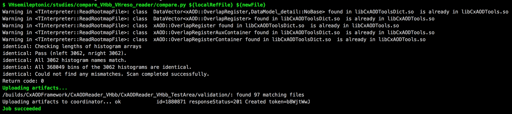
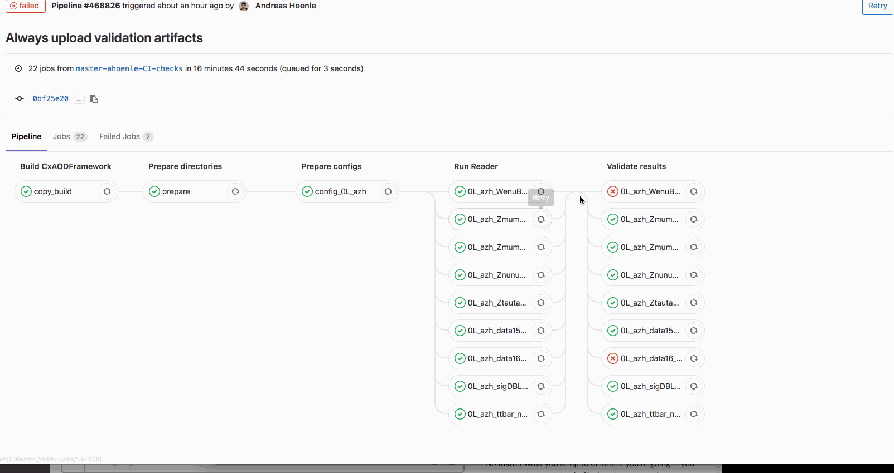
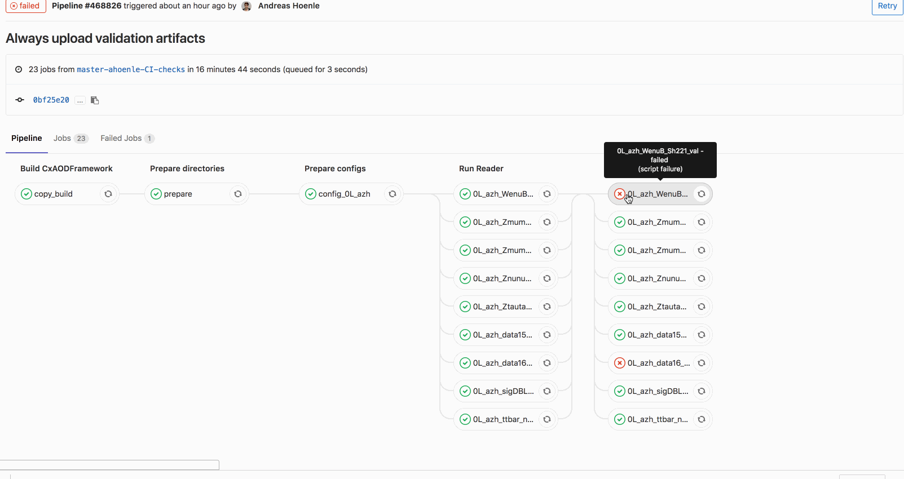

***This project is part of the [CxAODFramework](https://gitlab.cern.ch/CxAODFramework) the [wiki](https://gitlab.cern.ch/CxAODFramework/CxAODOperations_VHbb/wikis/home) contains detailed documentation.***

# CxAODFramework package CxAODReader_VHbb

[](https://gitlab.cern.ch/CxAODFramework/CxAODReader_VHbb/commits/master)

This is the package for CxAODReader subclasses with VHbb-like final states.
We currently have implementations for

* VHbb
    * Looking for (and observing!) the Z-associated h->bb decays
    * Cut-based and MVA-based analysis options
    * 0/1/2 lepton channels
* VHreso
    * Looking for HVT-type and AZh-type VH resonances
    * 0-lepton class independent, AnalysisReader_VHreso0Lep
    * 1-lepton class independent, AnalysisReader_VHreso1Lep
    * 1/2-lepton classes still part of AnalysisReaderVHbb{1,2}Lep
        * Currently working on VHreso 1/2-lepton classes
* VHcc
* VGamma

## Updated gitlab-CI workflow *suspended*

> This feature is suspended as of 2018-11-12.
> It will return if the CxAODFramework can be managed as submodules.
> Whether or not this is possible will be determined in the near future.

New features were added to the gitlab CI.
We encourage analysers to make use of the validation procedure.
A How-To is given below.

### Overview over the latest CI workflow

If you navigate to a recent pipeline you see that we have 5 stages

1. Build CxAODFramework
2. Prepare directories
3. Prepare configs
4. Run Reader
5. Validate results

The first step clones the project and compiles it.
The second step prepares directories for DAODs and CxAODs.
Analysers might have to introduce changes to steps 3. - 5.

### Stage 3: Prepare configs

In this step we copy the config `FrameworkExe/data/framework-read.cfg` and apply the required changes for the every analysis.
The generated output configs are saved in `${JOB_DIR_ABS}/config/config_Read_${derivName}.cfg`.
Don't worry that the config name is not unique because every config is generated in its own, independent job with independent job artifacts.

If you add a config, you best copy an existing template, like the one for the 0L AZh test.

```yaml
config_0L_azh:
 stage: Prepare configs
 dependencies:
  - build
  - copy_build
  - prepare
 tags:
   - cvmfs
 variables:
   selName: "0lep"
   derivName: "HIGG5D1"
 script:
  - pwd
  - ls -1
  - cp ${JOB_DIR_ABS}/source/FrameworkExe/data/framework-read.cfg ${JOB_DIR_ABS}/config/.
  - cp ${JOB_DIR_ABS}/config/framework-read.cfg ${JOB_DIR_ABS}/config/config_Read_${derivName}.cfg
  - sed -i '/string analysisType/c\string analysisType = '"${selName}"''             ${JOB_DIR_ABS}/config/config_Read_${derivName}.cfg
  - sed -i '/string modelType/c\string modelType = AZh'                              ${JOB_DIR_ABS}/config/config_Read_${derivName}.cfg
  - sed -i '/string analysisStrategy/c\string analysisStrategy = PriorityResolvedSR' ${JOB_DIR_ABS}/config/config_Read_${derivName}.cfg
  - sed -i '/bool doMergeCR/c\bool doMergeCR = true'                                 ${JOB_DIR_ABS}/config/config_Read_${derivName}.cfg
  - sed -i '/bool doMergeJetBins/c\bool doMergeJetBins = true'                       ${JOB_DIR_ABS}/config/config_Read_${derivName}.cfg
  - sed -i '/bool doBlindingMC/c\bool doBlindingMC = true'                           ${JOB_DIR_ABS}/config/config_Read_${derivName}.cfg
  - sed -i '/bool readBDTs/c\bool readBDTs = false'                                  ${JOB_DIR_ABS}/config/config_Read_${derivName}.cfg
  - sed -i '/bool doExtendedPlots/c\bool doExtendedPlots = true'                     ${JOB_DIR_ABS}/config/config_Read_${derivName}.cfg
  - sed -i '/bool doTLVPlots/c\bool doTLVPlots = true'                               ${JOB_DIR_ABS}/config/config_Read_${derivName}.cfg
  - cat ${JOB_DIR_ABS}/config/config_Read_${derivName}.cfg
 artifacts:
  paths:
   - ${JOB_DIR_ABS}/config/
  name: "${JOB_DIR}_${CI_JOB_STAGE}"
  expire_in: 3h
```

You only need to update the sections `variables` and `script` with your needs.
Do **not** change these two lines

```yaml
# _Never_ change these lines
  - cp ${JOB_DIR_ABS}/source/FrameworkExe/data/framework-read.cfg ${JOB_DIR_ABS}/config/.
  - cp ${JOB_DIR_ABS}/config/framework-read.cfg ${JOB_DIR_ABS}/config/config_Read_${derivName}.cfg
```


### Stage 4: Run Reader

Reader jobs usually run over a subset of one sample (1k - ~50k events).
They produce histogram output files, just as if you run them locally on your development machine.
They will upload their artifacts so that the histogram files can be retrieved in the validation stage.

There is a template that exectues most of the commands.
An example of how to use the template looks like this

```yaml
0L_azh_data15_read:
  # This jobs executes the hsg5frameworkReadCxAOD
  dependencies:
    # artifacts will be downloaded for all dependencies
    # if a job is not executed because of only/except rules this will *not* lead to errors
    # the artifacts will simply not be downloaded
    - build
    - copy_build
    - prepare
    - config_0L_azh
  variables: {
    nrEvents: "50000",  # maximal number of events, might be less if there are less in the file
    selName: 0lep,      # selection name that will be put into the config
    # The variables below specify the data path from were CxAODs are read
    # The following path must exist on lxplus: ${basePath}/${derivName}/${mcSubDir}/${subDir}
    derivName: HIGG5D1, # derivation name for output dir naming
    basePath: /afs/cern.ch/work/a/ahoenle/public/CxAODFramework_Ref/CxAOD/,
    process: data15,    # synonomous for sample. the sample to be processed
    mcSubDir: CxAOD_31-10_a,  # monte carlo period
    mcType: mc16a,      # to configure the correct PRW/XSec/yield files
    lumi: "36.1"        # to normalise MC
  }
  <<: *r21_read
```

###  Stage 5: Validation

**NEW!** Validation is a new feature and implemented for the 0lepton VHreso AZh test cases.
But it can be easily extended to all analyses!

> Don't worry if you're adding a new validation job and these files don't exist.
It's easy to add them with a single commit. See the section _Updating the reference samples_ below.

In this stage we can **either** compare against existing reference or update the references with the output that is produced in the _Run Reader_ stage.

#### Validation against reference samples

There is a `validate` template that does most of the validation.
An example of how to use it looks like this

```yaml
0L_azh_data15_val:
  # This job validates the CxAODReader output against reference histograms
  dependencies:
    - build
    - copy_build
    - prepare
    - 0L_azh_data15_read  # we read the output of this job
  variables: {
    # The variables below define where the reference histograms are located
    # The following path must exist on lxplus: ${refPath}/${derivName}_${process}_{mcSubDir}
    refPath: /afs/cern.ch/work/a/ahoenle/public/CxAODFramework_Ref/hist/,
    derivName: HIGG5D1,
    process: data15,
    mcSubDir: CxAOD_31-10_a,
    # We search for this filename in lxplus:${refPath}/${derivName}_${process}_{mcSubDir}
    file: hist-data15.root
  }
  <<: *validate
```

As indicated in the comments this requires reference histograms to be stored in `${refPath}/${derivName}_${process}_{mcSubDir}`.
Specifically, the will look for the file `${refPath}/${derivName}_${process}_{mcSubDir}/${file}`.

The validation script is developed in the VHreso analysis, but it is generic and will work for other analyses too.
In this CI we use the `release` branch. You can find the latest version of the code here: https://gitlab.cern.ch/atlas-phys/exot/dbl/Analyses/VHsemileptonic/tree/release

Merge requests with improvements are welcome.

> Validation artifacts are kept for seven days. If you need the output for later, make sure to download them.

##### Successful validation

If you navigate to the console output of a CI validation job that finished successfully you will see these lines



##### Failing validation: Number of histograms

It might be that the number of histgrams in the two files are different.
This can for example happen if the reference contains regions that are not there in your new inputs.

In this case the validation script will upload a diff to the artifacts.
For an example where I randomly added a `5tag7jet` category and removed other random histograms this file looks like this.

```
+ Indicates that a histogram is only in the 'left' file
- Indicates that a histogram is only in the 'right' file


+ W_5tag7jet_0ptv_SR_btag_weight_B
+ W_5tag7jet_0ptv_SR_eff_L
+ Wbb_5tag7jet_0ptv_SR_ActualMuScaled
+ Wbb_5tag7jet_0ptv_SR_METDirectional
+ Wbb_5tag7jet_0ptv_SR_NTags
+ 5 histograms

- W_0ptag0pjet_0ptv_SR_btag_weight_B
- W_0ptag0pjet_0ptv_SR_eff_L
- Wbb_0ptag2pjet_0ptv_SR_METVarL_hard
- 3 histograms
```



##### Failing validation: Bin content

If all histogram names are identical in both files the script will also check for differences in the bin contents.

It will upload plots with differences to the artifacts in case this fails.



#### Updating the reference samples

> Be aware that if you **commit** with a message that containts `[update-refs]` **and push** to origin you will update **all** references. This happends independently of whether or not the MR is accepted or even created. Currently there is no straight-forward implementation to limit this to only subjobs. Please double-check that you don't overwrite references of other analyses with different/wrong files.

This step can add new or update existing reference histograms.
As usual, there is a macro that does the heavy lifting and you can use it like this

```yaml
0L_azh_data15_update_ref:
  # This job updates the references stored in the ${refPath}
  dependencies:
    - 0L_azh_data15_read  # We take the output from this job as the new reference
  variables: {
    # The variables below define where the reference histograms are located
    # The following path will be created if it does not exist ${refPath}/${derivName}_${process}_{mcSubDir}
    refPath: /afs/cern.ch/work/a/ahoenle/public/CxAODFramework_Ref/hist/,
    derivName: HIGG5D1,
    process: data15,
    mcSubDir: CxAOD_31-10_a,
    # This job creates/overwrites this file
    file: hist-data15.root
  }
  <<: *update_refs
```

**Important note:** If you specify a location outside of the `vhbbframework` afs area you will have to grant access to the framework bot.

```
# (d)elete, (i)insert, (l)ist, (r)ead, (w)rite
fs sa /afs/cern.ch/your/directory vhbbframework dilrw
```

#### Example: Workflow of adding a new validation job

If you're adding a new validation job, follow this procedure

1. Checkout a dev branch as you normally do
2. Add your reader job to the _Run Reader_ stage by using the `r21_read` template in `.gitlab-ci.yml`
3. Add your validate job (we won't execute it right away) to the _Validate results_ stage by using the `validate` template in `.gitlab-ci.yml`
4. Add your update_ref job to the _Validate results_ stage by using the `update_refs` template in `.gitlab-ci.yml`
5. Commit **and push**. You commit message must contain `[update-refs]`.
6. The CI will be triggered. Make sure it finishes successfully.
7. _Optional:_ Check in an empty commit with `git commit --allow-empty -m <your message>` to trigger the pipeline in its default mode of operation.
8. **After the pipeline from Step 6 finsished.** You are ready to merge.

> Nice to know: If you want to check the syntax of your `.gitlab-ci.yml` before you commit, use the linter at https://gitlab.cern.ch/CxAODFramework/CxAODReader_VHbb/-/ci/lint.

### Expert: Using prebuilt executables

Every build job stores its full environment in a fixed path on `lxplus`, specifically `/afs/cern.ch/work/v/vhbbframework/public/bin`.
That means, that the latest build will always be available from this location.

If you want to use it, your commit needs to contain `[nobuild]`. For example

```
git commit -m '[nobuild] Add 1lepton HVT pipeline`
```
